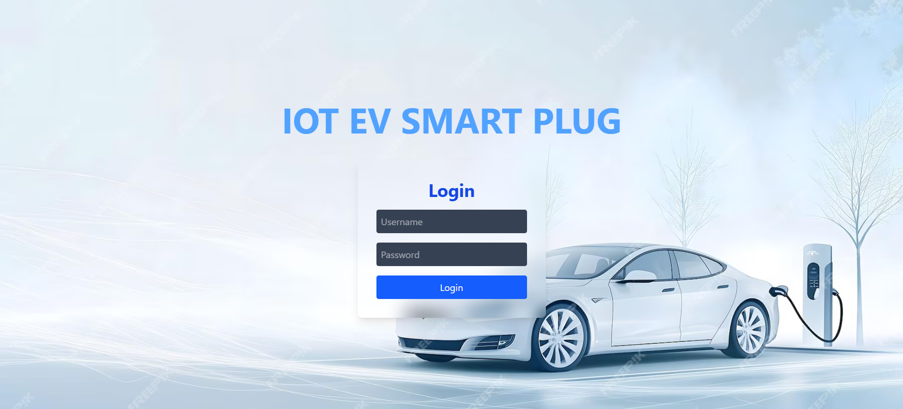

# 🔌 Smart EV Charging System

A real-time IoT-based web application to monitor and control electric vehicle (EV) charging, built using **ESP32**, **React.js**, and **REST APIs**. The system detects EV presence, initiates timed charging, monitors voltage/current/power live, and generates a dynamic bill upon completion.

## 🚀 Features

- 🔍 **EV Detection** using IR sensor (shows EV connected/disconnected)
- ⚡ **Live Monitoring** of:
  - Voltage (V)
  - Current (mA)
  - Power (W)
- ⏱️ **Timer-based Charging** via web interface
- 🧠 **Real-time Status** updates using REST API
- 📊 **Automatic Bill Generation** based on energy consumed (calculated in frontend)
- 🔐 **Login Authentication** to access dashboard
- 🎨 **Responsive UI** using Tailwind CSS and Framer Motion

## 🛠️ Tech Stack

| Frontend | Backend | Hardware |
|----------|---------|----------|
| React.js | ESP32 (Arduino) | IR Sensor, INA219, Relay, LCD |

## 🔗 System Flow

1. **Login Page** – Authenticates user.
2. **Dashboard** – Displays live data fetched from ESP32 (`/data` endpoint).
3. **Start Charging** – Sends a REST API request to ESP32 to begin charging (`/start?duration=...`).
4. **Charging Timer** – Starts and ends automatically.
5. **Billing** – After charging, a popup prompts the user to view the bill.
6. **Bill Page** – Shows calculated energy and total amount based on:

## 📡 ESP32 REST APIs

- `GET /data` → Returns JSON with IR status, voltage, current, and power.
- `GET /start?duration=x` → Starts charging for `x` seconds.

## 📷 UI Preview

## 🧾 Sample Bill Output

- Voltage: 229.0 V  
- Current: 321.5 mA  
- Duration: 60 seconds  
- Energy: 0.0122 kWh  
- Rate: ₹15 per kWh  
- **Total Bill: ₹0.18**

## 📂 Folder Structure

/smart-ev-charging ├── client/ # React frontend │ └── src/ │ └── components/ │ └── Dashboard.jsx │ └── Bill.jsx │ └── Login.jsx ├── esp32-code/ # Arduino code for ESP32

## 👤 Author

**Glenn Pamar**  
B.Tech – Electrical Engineering  

---

> Feel free to ⭐ this repo if you like it, and fork it if you'd like to build on top of it!

